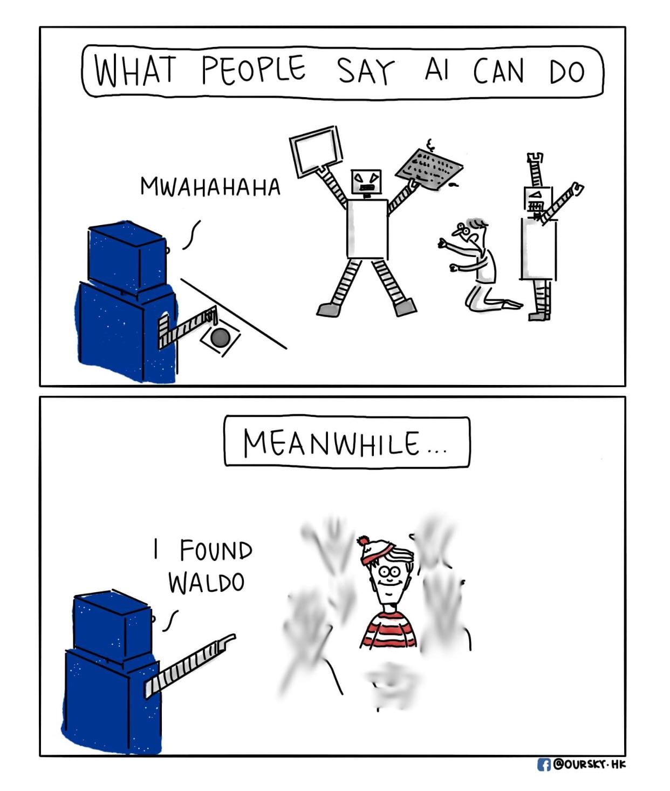

# Intro to AI

Artificial Intelligence (AI) has rapidly become an overwhelming force in education, especially in disciplines that rely on problem-solving and technical proficiency such as Software Engineering. In ICS 314, AI has played a role in enhancing how I understand and apply software engineering concepts. Tools like ChatGPT and GitHub Co-Pilot have become virtual study partners for me! While ChatGPT was my primary resource, I occasionally tested alternatives to compare results. These tools contributed in varied ways across assignments, coding practice, and conceptual understanding, but not without limitations.

# Personal Experience with AI

### WODs 

For the experience WODs we would do in ICS 314, I typically ask ChatGPT, "Can you explain to me what this function does?" and ChatGPT gave a clear answer but it lacked some context-specific logic. I had to refactor its code to align with the exact instructions. It was helpful to get started, but refinement was essential. For in class practice WODs, I often skipped AI assistance here to really get myself in real-time pressure. I believed practicing independently improved speed and confidence in my code. Now for in class WODs, I usually used ChatGPT to remind me of what specific functions were. For example, I would ask, "Okay, what function can I use to insert an image?" and I would use what they would give me and test it. Overall, the costs of using AI led me to have a better understanding in some of the functions and saved me plenty of time.

### Projects

ChatGPT was very helpful for brainstorming some structure for my essays and had great rewordings for clarity. For example, one of the prompts I would ask, “How would I structure a reflection essay about UI Franeworks in software engineering?” It suggested an outline that really followed nicely to the assignment prompt. I then would feed it my paragraphs and asked for improvements in flow and conciseness. Now for the final project, I used ChatGPT to assist in debugging. One time I asked, “How do I setup the navbar with this code...” and I would show them a snippet of my code. It produced answers that I would build off from, but I really wanted to make sure I do not blindly follow it. I had to adjust the code as sometimes, it even removed some other code I had inside my file! Mainly, this was typically the cost of using AI in these big assignments/projects. I never understood why it would remove some of the code or how it truly reads in these prompts I give, but it is something to be mindful of despite the possible successes it has. 

### Learning a Concept / Asking for Help
As stated earlier for the WODs, I used ChatGPT to clarify concepts I found unclear in class. Saying to ChatGPT, “Explain to me the workflow of React," offered a concise explanation and a working example, which I modified to test locally. This improved both comprehension and my ability to retain these concepts!

I typically didn’t use AI in live situations like class or Discord discussions, preferring to rely on lecture notes or documentation. It felt important to engage directly with peers or TAs for deeper understanding. Before asking smart questions, I usually went to ChatGPT first to avoid asking something easily searchable. For example, “Why might this database not connect to Vercel?” ChatGPT helped me narrow the issue to the links I am using to connect my databases, allowing me to ask a more targeted question in Discord. Coding Example (e.g., “give an example of using Underscore .pluck”)

Again, as stated earlier, when learning a concept, I used ChatGPT helped clarify concepts. Sometimes, it would be through the use of coding examples. "Show me how to set up a navbar in TypeScript" and it responded with exactly what I needed. These were some of its most successful use cases. Additionally, explaining code that experience WODs would give in the tutorial video would help. “Explain what this JavaScript function does line-by-line.” It was accurate most of the time, though occasionally it skipped over some logic or missed edge cases. Still, a good aid for review.

### Writing Code
As stated earlier, I would build off code that ChatGPT uses, but not blindly use them. I’d start with a prompt like: “Write a method to insert a new price when a user submits it.” It usually gave a usable base but I always needed context-aware modifications, so that is where I adjust accordingly. For documenting code, AI was highly effective here. I would ask, “Generate comments for the following code...” and the generated comments were consistent and saved time, though I always read through and occasionally adjusted some terminology.This would go along with quality assurance. For code with ESLint or runtime errors, I’d often paste the snippet into ChatGPT. One example I would ask is, “Fix the ESLint issues in the following code.” It identified problems quickly and even commented them.

### Other Uses in ICS 314
I would sometimes have ChatGPT refer some resources I can look at to better understand some functions. "Where did you get this specific function to do this calculation?" is what I would have to ask a few times. 
This approach improved my ability to explain to myself and peers on why the function I chose in the end is the best option.

# Impact on Learning and Understanding

AI significantly improved my understanding of complex topics. By offering diverse examples and alternative phrasing compared to what the class offered, it made abstract concepts more concrete for me. I became more confident in debugging and applying design principles. However, it also introduced the temptation to offload thinking, something I had to resist by always reviewing and modifying the generated content.

# Practical Applications

Outside ICS 314, I used AI for a research project to fix my plots and write documentation. It sped up setup and explained new frameworks like rasterizing. However, it lacked project-specific context, which sometimes led to misleading results.

# Challenges and Opportunities
The biggest challenge with AI is knowing when not to rely on it. Blindly trusting the output leads to bugs or even logic flaws. But when used to brainstorm, clarify, or cross-check, it becomes a powerful extension of your thought process. An opportunity going forward is integrating AI tools directly into IDEs (e.g., Co-Pilot) for in-line support with project context.

# Comparative Analysis

Traditional teaching methods, in my opinion, usually have this foundational discipline and deeper mental models for their topics. AI, on the other hand, offers speed, accessibility, and diversity of explanation. I found that the best learning happened when both were combined: lecture for core concepts, AI for reinforcement and experimentation. For instance, after a lesson on UI Frameworks, I could immediately test my understanding using ChatGPT for related examples.

# Future Considerations

AI will likely become a standard companion in software engineering education. Future systems may adapt to individual learning styles, integrate with VS Code or GitHub, and provide context that is aware of the type of assistance it needs to give across the software stack. However, AI must be framed as a co-learner, not a crutch. Students must still build intuition, judgment, and the ability to explain solutions independently.

# Conclusion

Reflecting on ICS 314, AI has played a valuable role in my journey as a software engineer. When used critically and ethically, tools like ChatGPT can enhance learning, provide clarity, and improve productivity. However, they are no substitute for the real process of thinking, struggling, and growing as a developer. I recommend future students treat AI as a smart assistant that is helpful, but not incapable of making mistakes or being wrong. They must always strive to understand why a solution works, not just that it does!