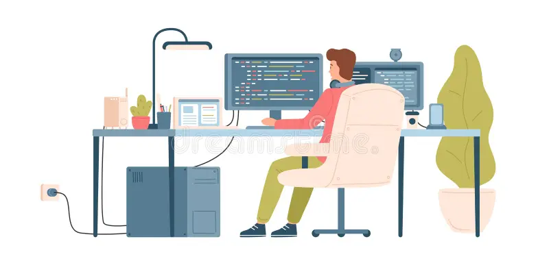

Software engineering is more than just writing code—it is a discipline that merges creativity with problem-solving to build solutions that shape the future. My interest in this field stems from a fascination with how technology can streamline complex processes, automate tasks, and enhance user experiences. The logical nature of programming, combined with the vast possibilities for innovation, excites me and fuels my desire to continue exploring new concepts in software development. Whether it is designing efficient algorithms, optimizing performance, or working with scalable architectures, I find the challenge of problem-solving in software engineering both engaging and rewarding.

As I continue my journey, I hope to develop strong technical skills in areas such as full-stack development, cloud computing, and artificial intelligence. Mastering languages like Python, Java, and JavaScript will allow me to build versatile applications, while gaining expertise in cloud platforms like AWS or Google Cloud will help me understand how to create scalable, distributed systems. Additionally, I aim to enhance my knowledge of data structures and algorithms, as they are fundamental to writing efficient and optimized code. 

## Projects

Beyond technical skills, I also want to seek experiences that challenge me to think critically and collaborate with others. Working on real-world projects and contributing to open-source software will provide valuable hands-on experience and help me develop problem-solving skills under real constraints. Previously, I was a computational physicists for the VIA-SEEs project and I would design and create simulations for our particle detector. The whole experience gave me a great insight on this real-world experience I was looking for. Ultimately, I want to become a well-rounded software engineer who can contribute to meaningful projects, adapt to emerging technologies, and continuously refine my skills in this ever-evolving industry! 

