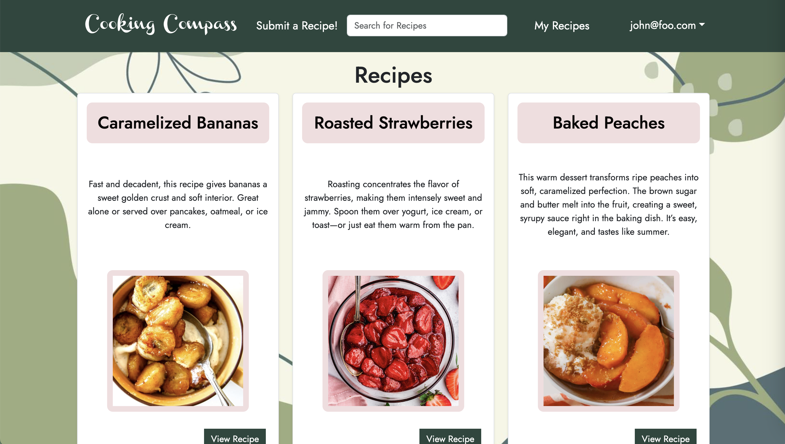

The goal of this site is to help improve the nutritional habits of students by offering a collection of recipes shared by their fellow UH peers. By browsing through these student-submitted recipes, users can discover new, creative, and nutritious meal ideas. To ensure the quality and authenticity of the content, administrators moderate the site to filter out any inappropriate or joke submissions.

My contributions to the project included setting up and connecting the PostgreSQL database hosted on Vercel, as well as helping integrate the website’s various pages with the database. I focused primarily on the recipe listing page, which I both designed and implemented to display all submitted recipes in an accessible and organized way. I also assisted with the development of the “About Us” page.

Working on Cooking Compass with three other team members was a valuable experience in collaborative software development. Until now, most of my computer science work had been individual, so this project introduced me to the dynamics of team-based development. Meeting deadlines, maintaining clear and frequent communication, and writing code that others rely on were all challenges that helped me grow. While I certainly gained technical experience using Next.js and PostgreSQL to build a full-stack application, the most important lessons I learned were in teamwork and project coordination.

